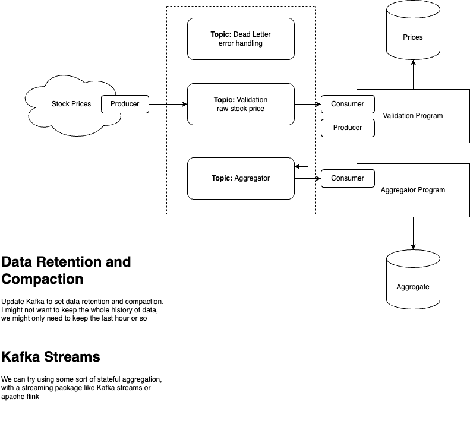

# Event Driven Python-Kafka Pipeline

**Tech Used**: Apache Kafka, Python, Docker

- [How to Run](#how-to-run)
- [Next Steps](#next-steps)

## What is this Project?

In this project, I wanted put theory into practice with developing a Kafka cluster listening for real-time events, and storing them into a Postgres database

Kafka cluster is hosted via Docker, using [Bitnami - Kafka](https://github.com/bitnami/containers/tree/main/bitnami/kafka) docker images. With Bitnami, we can streamline to creation and tear down of a kafka cluster for local testing. After getting setup for the first time, this is a great tool for learning and gaining experience with Kafka (highly recommend)

Postgres is also hosted in Docker, using [Bitnami - Postgres](https://github.com/bitnami/containers/blob/main/bitnami/postgresql)

### Pipeline Design

The pipeline is fairly simply, where we use Python to generate a series of events and send them to a Kafka Topic



The output is generate from a Postgres database, where we store the raw data and periodic aggregates that can be used for reporting


## Output

Tables in Postgres

Files output

## How to run

### Setting up conda env

I've include my conda env file to recreate my same environment

```zsh
conda env create -f environment.yml
```

Settings for Kafka / Postgres can be found in the `docker-compose.yml` file

Start the Kafka + Postgres backend: `docker-compose up -d`

Note: `-d` is used to run docker in detached mode, so that your terminal doesn't hang (something I learned the hard way)

Start the streaming with Python + Faust:
1. Start the producer (where our fake data is being genereated)
```zsh
faust producer worker --without-web
```

2. Start the consumer (where our fake data is written to Postgres)
```zsh
faust consumer worker --without-web
```
**Note**: `--without-web` here is needed so that our 2 faust instances don't try and take the same socket


3. Star the aggregator (output postgress file)
```zsh
faust aggregator worker --without-web
```

---
## Next Steps

- Adding a Kafka Streams to process stateful aggregation
  - Or some other streaming package like Flink or Apache Beam
- Adding a security layer, SSL/TLS, for data in-transit. Try including sensitive data, and encoding the data at-rest
- Using my own docker image for `docker-compose` 
